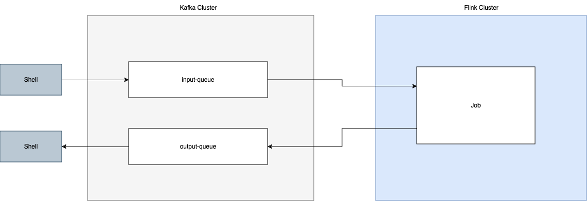

# Confluent Course:  Building Apache Flink® Applications in Java

## Summary
- Intro course to 1/ building Flink jobs with Java that 2/ integrate with Kafka
- Focusing on using the DataStream API to construct the pipeline
  - Note: We _touch_ on using Process function - see classes under the `daribig.streaming.functions` namespace

## Meta
- Course link: https://developer.confluent.io/courses/flink-java/overview/
- Course's GitHub repo: https://github.com/confluentinc/learn-building-flink-applications-in-java-exercises
- Kafka binary index: https://kafka.apache.org/downloads
- Flink binary index: https://flink.apache.org/downloads/

## General
- Jobs are currently built against Flink's 1.17 APIs - if you need newer APIs, or you're targeting a cluster running a newer version of Flink, then bump this (edit `pom.xml`)

## Shortcuts

### Kafka

#### Meta

```shell
cd kafka_*/ # cd into kafka binary
```

#### Create cluster

Startup a new Kafka cluster (using Raft for consensus)

```shell
KAFKA_CLUSTER_ID="$(bin/kafka-storage.sh random-uuid)"
bin/kafka-storage.sh format --standalone -t $KAFKA_CLUSTER_ID -c config/kraft/reconfig-server.properties
bin/kafka-server-start.sh config/kraft/reconfig-server.properties
```

#### Delete cluster

Exit the `bin/kafka-server-start.sh` process (it's coupled to the shell session that started it)

If for whatever reason you decoupled the `bin/kafka-server-start.sh` process, find its process ID via

```shell
ps aux | grep kafka-server-start.sh
```

And then kill it

```shell
kill <process-id>
```

If it refuses to listen to the `SIGKILL`, then send a `SIGTERM`

```shell
kill -9 <process-id>
```

#### Managing cluster

List topics

```shell
bin/kafka-topics.sh --list --bootstrap-server localhost:9092
```

Create topic

```shell
bin/kafka-topics.sh --create --topic event-queue --bootstrap-server localhost:9092
```

REPL for writing to topic

```shell
bin/kafka-console-producer.sh --topic event-queue --bootstrap-server localhost:9092
```


Read from topic

```shell
bin/kafka-console-consumer.sh --topic event-queue --from-beginning --bootstrap-server localhost:9092
```


### Flink

#### Meta

```shell
cd flink-*/ # cd into flink binary
alias flink=$(pwd)/bin/flink
```


#### Create cluster

Create cluster with 1 worker

```shell
bin/start-cluster.sh
bin/taskmanager.sh start # repeat n times to create n workers
```

#### Delete cluster

Delete the cluster

```shell
/bin/stop-cluster.sh
```

If for whatever reason this doesn't cleanup all the cluster's workers, then find their process IDs via

```shell
ps aux | grep flink | grep taskmanager
```

And then kill them

```shell
kill <process-id>
```

#### Manage cluster

List running jobs

```shell
flink list
```

Cancel a job

```shell
flink cancel <job-id>
```

Submit JAR to Flink cluster (note: `-c` parameter is for specifying the entrypoint class - the entrypoint should be the `*Job.java` class that does the 1/ top-level construction of the job and 2/ submits the job via calling `org.apache.flink.streaming.api.environment.StreamExecutionEnvironment.execute(java.lang.String)`.)

```shell
flink run -c daribig.streaming.PlaygroundJob target/kafka-playground-0.1.jar
```

Submit JAR to Flink cluster in detached mode (command will return after the submission is done)

```shell
flink run --detached -c daribig.streaming.PlaygroundJob target/kafka-playground-0.1.jar
```

#### Build job

Build JAR

```shell
mvn clean package # built jar is placed at `target/kafka-playground-0.1.jar` 
```

### Misc

- List classes in JAR

```shell
jar -tf <jar>
```

- `daribig.streaming.PlaygroundJob` defines the following bare-bones, and therefore foundational, local feedback loop: (assumes you've setup shell REPLs for 1/ writing records into the pipeline and 2/ reading records emitted from the pipeline - see above commands for how to set this up)




## Notes to self
- Purpose of `dependency-reduced-pom.xml` - [SO Answer](https://stackoverflow.com/a/35638574).
  - TLDR:
    - The `dependency-reduced-pom.xml` removes transitive dependencies which are already in your shaded jar. This prevents consumers from pulling them in twice.
    - We don't have any consumers of this package, so don't worry about it
    - It's a build artifact - it's output/generated from a `mvn build` build.
